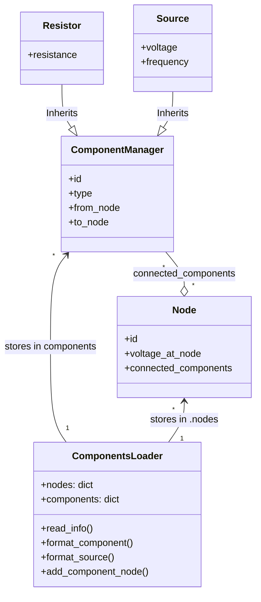

```mermaid

classDiagram
    direction BT
    class ComponentManager {
        +id
        +type
        +from_node
        +to_node
    }
    class Resistor {
        +resistance
    }
    class Source {
        +voltage
        +frequency
    }
    class Node {
        +id
        +voltage_at_node
        +connected_components
    }
    class ComponentsLoader {
        +nodes: dict
        +components: dict
        +read_info()
        +format_component()
        +format_source()
        +add_component_node()
    }
    
    ComponentManager <|-- Resistor : Inherits
    ComponentManager <|-- Source : Inherits
    ComponentsLoader "1" --> "*" ComponentManager : stores in components
    ComponentsLoader "1" --> "*" Node : stores in .nodes
    Node "*" o-- "*" ComponentManager : connected_components
```