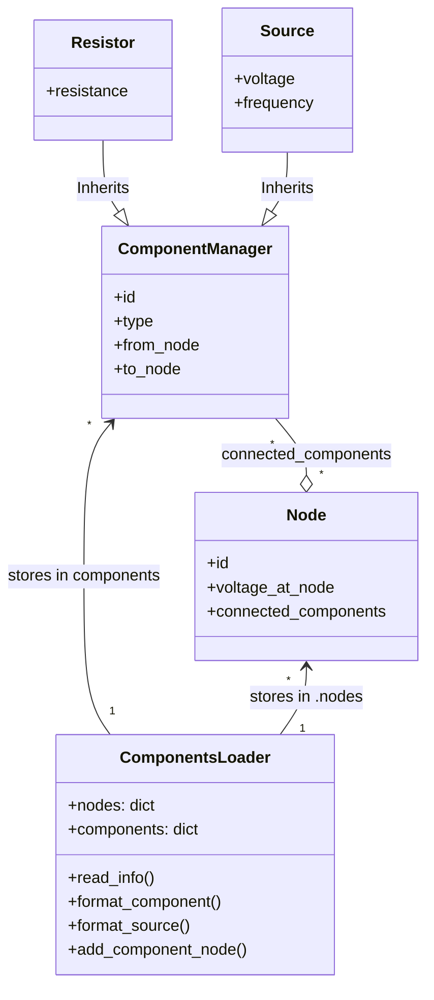
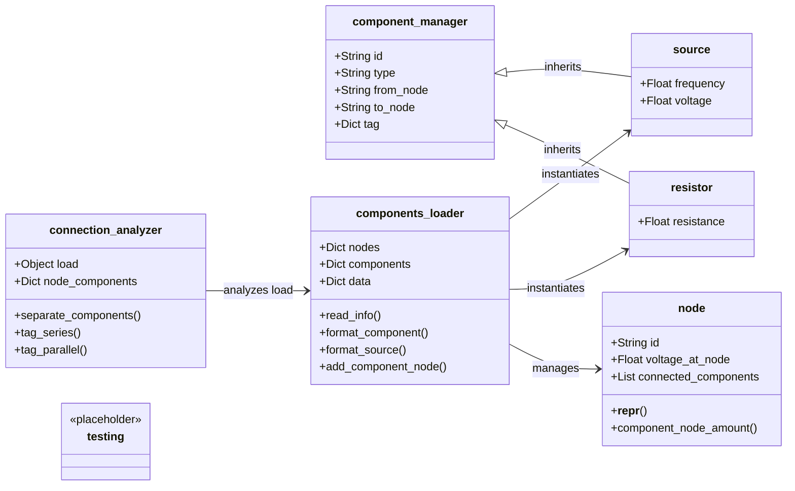
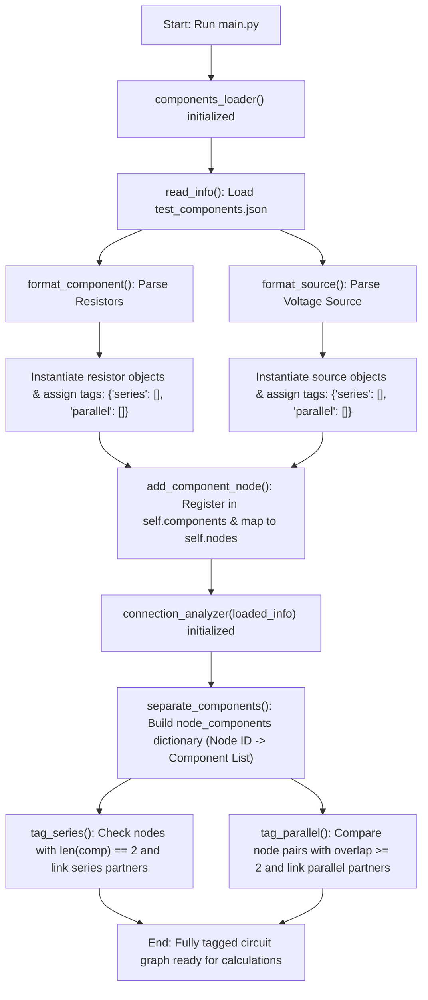

```mermaid

classDiagram
    direction BT
    class ComponentManager {
        +id
        +type
        +from_node
        +to_node
    }
    class Resistor {
        +resistance
    }
    class Source {
        +voltage
        +frequency
    }
    class Node {
        +id
        +voltage_at_node
        +connected_components
    }
    class ComponentsLoader {
        +nodes: dict
        +components: dict
        +read_info()
        +format_component()
        +format_source()
        +add_component_node()
    }
    
    ComponentManager <|-- Resistor : Inherits
    ComponentManager <|-- Source : Inherits
    ComponentsLoader "1" --> "*" ComponentManager : stores in components
    ComponentsLoader "1" --> "*" Node : stores in .nodes
    Node "*" o-- "*" ComponentManager : connected_components
```

```mermaid
classDiagram
    direction LR

    class component_manager {
        +String id
        +String type
        +String from_node
        +String to_node
        +Dict tag
    }

    class resistor {
        +Float resistance
    }

    class source {
        +Float frequency
        +Float voltage
    }

    class node {
        +String id
        +Float voltage_at_node
        +List connected_components
        +__repr__()
        +component_node_amount()
    }

    class components_loader {
        +Dict nodes
        +Dict components
        +Dict data
        +read_info()
        +format_component()
        +format_source()
        +add_component_node()
    }

    class connection_analyzer {
        +Object load
        +Dict node_components
        +separate_components()
        +tag_series()
        +tag_parallel()
    }

    class testing {
        <<placeholder>>
    }

    %% Inheritance Relationships
    component_manager <|-- resistor : inherits
    component_manager <|-- source : inherits

    %% Association / Dependency Relationships
    components_loader --> node : manages
    components_loader --> resistor : instantiates
    components_loader --> source : instantiates
    connection_analyzer --> components_loader : analyzes load

```

```mermaid

graph TD
    %% Execution Order Flowchart
    A["Start: Run main.py"] --> B["components_loader() initialized"]
    B --> C["read_info(): Load test_components.json"]
    
    C --> D["format_component(): Parse Resistors"]
    C --> E["format_source(): Parse Voltage Source"]
    
    D --> F["Instantiate resistor objects & assign tags: {'series': [], 'parallel': []}"]
    E --> G["Instantiate source objects & assign tags: {'series': [], 'parallel': []}"]
    
    F --> H["add_component_node(): Register in self.components & map to self.nodes"]
    G --> H
    
    H --> I["connection_analyzer(loaded_info) initialized"]
    I --> J["separate_components(): Build node_components dictionary (Node ID -> Component List)"]
    
    J --> K["tag_series(): Check nodes with len(comp) == 2 and link series partners"]
    J --> L["tag_parallel(): Compare node pairs with overlap >= 2 and link parallel partners"]
    
    K --> M["End: Fully tagged circuit graph ready for calculations"]
    L --> M
```